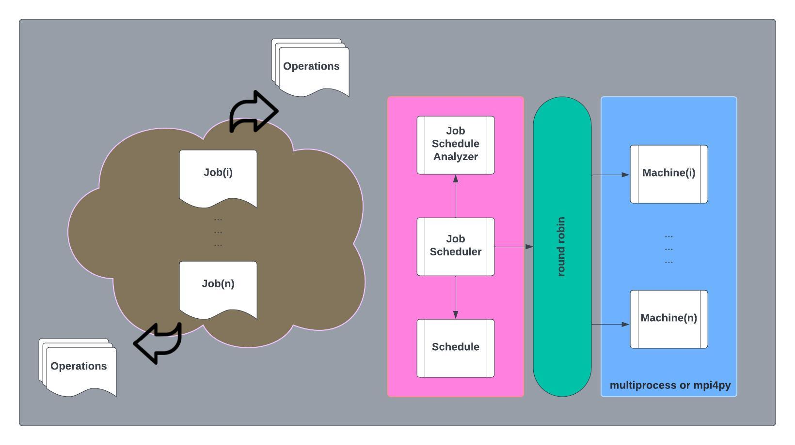

<!-- ABOUT THE PROJECT -->

## About The Project

The application is centered around a real-world scheduling problem. This project will focus on a different type of optimization problem which is the Job Shop scheduling problem. This is a problem that occurs commonly in Industry across a number of different application domains. Some applications of job shop scheduling include process scheduling at a server farm, packet routing across a computer network, job scheduling at a manufacturing plant, amongst many others.

In job scheduling J jobs are scheduled for processing at M machines. Each job has a fixed number of operations (N). The problem then is to allocate the jobs and their corresponding operations such that the overall completion time (referred to as the makespan) is minimized.

<b>Figure 1 - Job Schedule Optimization</b>


<!-- Design -->
## Agent Architecture

This project will utilize a model-based, utility-based agent.  The agent will be an Informed Search heuristics that implements a combinatorial optimization algorithm known as Simulated Annealing (SA).  As a factored representation, SA consists as various states where each state consists of a vector of attribute values.  In general, "combinatorial optimization problems can be viewed as searching for the best element of some sort of discrete items"[^1].  As NP complete, or O(bn), problems where N is the number of actions and b or P is the maximum branch factor into out of an action. An NP optimization (NPO) problem has the following properties [^1]:
* the size oef every feasible solution y ∈ f(x) is polynomially bounded in the size given instance x [and I is the set of input instances],
* the languages { x | x ∈ I } and { (x,y) | y ∈ f(x) } can be recognized in polynomial time, and
* m is the polynomial-time computable.

In particular, this project is a subclass of problems known as NPO(II) or Polynomial-Time Approximation Scheme (PTAS).  This type of sub probbem contains the makespan scheduling problem.

Furthermore, the job scheduling is a constraint satisfaction problem (CSP).  This is due in large part because each variable in the problem domain has a value that satisfies all the constraints on the variable. "The main idea is to eliminate the large portions of the search space all at once by identifying variable/value combinations that violate the constraint."  The CSP composition (X, D, C) is as follows:
* X is a set of variables, {Xi, ...., Xn}
* D is a set od domains, {Di, ..., Dn}
* C is a set of constraints that specify allowable combinations.  Each constraint Cj consists of:
  * A pair <scope, relation> where scope is a tuple of variables that participate in the constraint and relation defines the values those variables can take on.

<b>Table 1 - Aritificial Intelligence (A.I.) Project Archetype</b>

| Type            | Sub Type                   | Algorithm                |
|-----------------|----------------------------|--------------------------|
| Informed Search | Combinatorial Optimization | Simulated Annealing (SA) |

The SA algorithm "is a probabilistic technique for approximating the global optimum of a given function.  Specifically, it is a metaheuristic to approximate global optimization in a large search space for an optimization problem.  The name of the algorithm comes from the annealing in metallurgy, a technique involving heating and controlled cooling of a material to alter its physical properties." [^2]  The SA decomposition of the problem formulation for this job scheduling project is modeled as follows:
1. Initial State - Ordered list or sequence od scheduled jobs
2. Objective Function (Value/Cost) -  Minimize makespan
3. Temperature Schedule - Controls the probability of accepting worse solutions during the search of the optimal solution
4. Successor Function - Explore the neighborhood of scheduling jobs
   * Scheduling jobs generate neighboring solutions by making small changes to the schedule
5. Goal Test - All jobs are scheduled

The CSP for the job scheduling problem is modeled as follows:
* Scope is composed of the following variables:
  * Jobs - Individual unit of work that needs to be completed.
  * Operations - Atomic steps or tasks that are needed to complete the overall job.
  * Machines - Resource that performs the operations
* Relation composed of the following values:
  * Number of jobs scheduled per machine
  * Number of operations scheduled per job
  * Number of machines online

<p align="right">(<a href="#readme-top">back to top</a>)</p>


<!-- Design -->
## High-level Agent Design
The system is designed exclusively with model objects such as jobs, operations, scheduler, optimizer, and machines (Table 1 and Figure 2).

<b>Table 1 - System (Agent/Environmental) Component Descriptions</b>

| Component         | Description                                                           | 
|-------------------|-----------------------------------------------------------------------|
| Jobs  | Individual unit of work that needs to be completed. | 
| Operations | Atomic steps or tasks that are needed to complete the overall job. |
| Job Scheduler  |  Subsystem that manages, controls, and optimizes the scheduling of jobs. |
| Job Schedule Optimizer  | Subsystem that finds the best order of job operations to minimize machine idle time and minimize makespan to complete all jobs. |
| Machines  | Resource that performs the operations. |

<br>

A high-level topology of the job schedule system is in Figure 2.

<b>Figure 2 - Job Schedule (Agent/Environmental) System Topology</b>



A more detailed flow of the job schedule is in Figure 3 that shows how the system will function in real-time.

<b>Figure 3 - Job Schedule (Agent/Environmental) Sequence Diagram</b>


<br>

<p align="right">(<a href="#readme-top">back to top</a>)</p>

## Low-level Agent Design

The various variables or parameters that will be utilized within job scheduling system are the constraints of the number of jobs, number of machines, number of operations, time it takes to complete an operation, temperature, and  number of operations in Table 2.
<b>Table 2 - Parameters</b>

|             | Variable | Description                                                                                                                             | Data Type | Fixed Value | Default Value | Rule                           | 
|-------------|----------|-----------------------------------------------------------------------------------------------------------------------------------------|----|------------|--------------|--------------------------------|
| Requirement |          |                                                                                                                                         |    |            |              |                                | 
| R3-R5       | T        | Temperature of the job scheduling system that functions to cool off the system (ie. minimizing errors for inferior scheduling actions). | integer | 1000       |              |                                |   
| R3-R5       | i        | Number of scheduling iterations in order to optimize the schedule.                                                                      | integer | 400        |              |                                |
| R3-R5       | r        | Randomly selected successor of the current job scheduling action.                                                                       | float |            |              | Random value between 0 and 1.  |
| R3          | M        | Number of machines online and available to complete a particular schedule.                                                              | integer |            |              |                                |
| R4          | ""       | ""                                                                                                                                      | "" | 5          |            |                                |
| R5          | ""       | ""                                                                                                                                      | "" | 3          |            |                                |
| R3          | N        | Number of jobs needed to complete a particular schedule.                                                                                | integer |            |              |                                |  
| R4          | ""       | ""                                                                                                                                      | "" | 50         |            |                                |
| R5          | ""       | ""                                                                                                                                      | "" | 50         |            |                                |
| R3          | O        | Number of operations per job.                                                                                                           | integer |            |              |                                |  
| R4          | ""       | ""                                                                                                                                      | "" | 5          |            |                                |
| R5          | ""       | ""                                                                                                                                      | "" | 5          |            |                                |
| R3          | t        | Take it takes to complete a specific operation.                                                                  | integer |            |              |                                |
| R4-R5       | ""       | ""                                                                                                                                      | "" |            |            | Random value between 5 and 50. |


### Job Scheduler
The pseudo code for the Job Scheduler module is outlined below.  The code essentially outlines the usage of an emperical gradient where progress is measured by the objective function to minimize the makespan.  This is accomplished evaluating the scheduling differences between the next job operation and the current one.
```shell
    T = 1000 	# Set the initial temperature T
    schedule.create_schedule(n_jobs)
    
    machine.schedule_jobs(schedule, n_operations)
    
    for in range(0, 400) then:
        job_schedule_analyzer.analyze_schedule(schedule)
            
        machine.schedule_jobs(schedule, n_operations)
        
        job_schedule_analyzer.analyze_schedule(schedule)
        
        ∆E = job_schedule_analyzer.minimize_execution_time(schedule)

        if ∆E > 0 then: 
          current=next
        else:
          r = rand.random(0,1) # Generate a random value in the range 0 to 1
        
        if (e^(∆E / T) ≤ r) then:
            current = next # Accept a worse solution with probability r */
          i = i + 1
          T = T * 0.99 # Cool the temperature by a factor of 0.99 */
        else:
          return current
```

### Job Scheduler Analyzer
The pseudo code for the Job Scheduler Analyzer module is outlined below:
```shell
function analyze_schedule(schedule): 
  # The function successor generates a neighboring solution to the current solution
  # the successor function takes two random points (jobs) in the existing job schedule and swaps their order
  next_job_sched=successor(schedule.current_job_sched,N) 
  next_opt_sched=allocate_ops_to_machines(schedule.next_job_schedule,N,M) 

function minimize_execution_time(schedule):
  ∆E = comp_makespan(schedule.next_opt_sched)- comp_makespan(schedule.current_opt_sched)
  
  return ∆E              
````

<p align="right">(<a href="#readme-top">back to top</a>)</p>

### Built With

This section lists all major frameworks/libraries used to bootstrap this project.

* [![Python][Python.org]][Python-url]
* [![Jupyter][Jupyter.org]][Jupyter-url]
* [![Miniconda][Miniconda.com]][Miniconda-url]

<!-- GETTING STARTED -->

## Getting Started

Following the instructions below should get you up and running and quickly as possible without googling around to run
the code.

### Prerequisites

Below is the list things you need to use the software and how to install them. Note, these instructions assume you are
using a Mac OS. If you are using Windows you will need to go through these instructions yourself and update this READ
for future users.

1. miniconda
   ```sh
   cd /tmp
   curl -L -O "https://github.com/conda-forge/miniforge/releases/latest/download/Mambaforge-$(uname)-$(uname -m).sh"
   bash Mambaforge-$(uname)-$(uname -m).sh
   ```

2. Restart new terminal session in order to initiate mini conda environmental setup
   
### Installation

Below is the list of steps for installing and setting up the app. These instructions do not rely on any external
dependencies or services outside of the prerequisites above.

1. Clone the repo
   ```sh
   git clone git@github.com:johnsonlarryl/csce_5210.git
   ```
2. Install notebook
   ```
   cd traffic_simulator
   conda env create -f environment.yml
   conda activate traffic_simulator
   ```

<p align="right">(<a href="#readme-top">back to top</a>)

<!-- USAGE EXAMPLES -->

## Usage

In order to view or execute the various notebooks run the following command on any of the sub folders in this directory.

Here is an example to launch the Traffic Simulator and Analysis Notebooks.

```sh
jupyter notebook
```

Once inside the
notebook [use the following link](https://jupyter-notebook.readthedocs.io/en/stable/examples/Notebook/Running%20Code.html)
on examples of how to use the notebook.

<p align="right">(<a href="#readme-top">back to top</a>)</p>

<!-- ACKNOWLEDGEMENT -->
## Acknowledgements
* Richard S. Sutton, Andrew G. Barto. Reinforcement Learning, second edition: An Introduction (Adaptive Computation and Machine Learning series), 2nd edition. Bradford Books, 2018.
* Peter Norvig, Stuart Russell. Artificial Intelligence: A Modern Approach, Global Edition, 4th edition. Pearson, 2021.

<!-- CONTACT -->

## Contact
[Larry Johnson](mailto:johnson.larry.l@gmail.com)
<br>


Project Link: [https://https://github.com/johnsonlarryl/csce_5210](https://github.com/johnsonlarryl/csce_5210)

<p align="right">(<a href="#readme-top">back to top</a>)</p>

<!-- MARKDOWN LINKS & IMAGES -->
<!-- https://www.markdownguide.org/basic-syntax/#reference-style-links -->

[Jupyter-url]:https://jupyter.org

[Jupyter.org]:https://img.shields.io/badge/Jupyter-F37626.svg?&style=for-the-badge&logo=Jupyter&logoColor=white

[Python-url]:https://python.org

[Python.org]:https://img.shields.io/badge/Python-3776AB?style=for-the-badge&logo=python&logoColor=white

[Miniconda-url]:https://docs.conda.io/

[Miniconda.com]:https://img.shields.io/badge/conda-342B029.svg?&style=for-the-badge&logo=anaconda&logoColor=white

<!-- REFERENCES -->
[^1]: [Combinatorial Optimization](https://en.wikipedia.org/wiki/Combinatorial_optimization)
<br>
[^2]: [Simulated Annealing](https://en.wikipedia.org/wiki/Simulated_annealing)