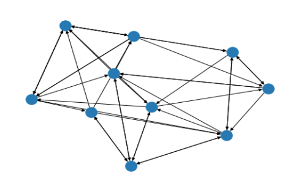
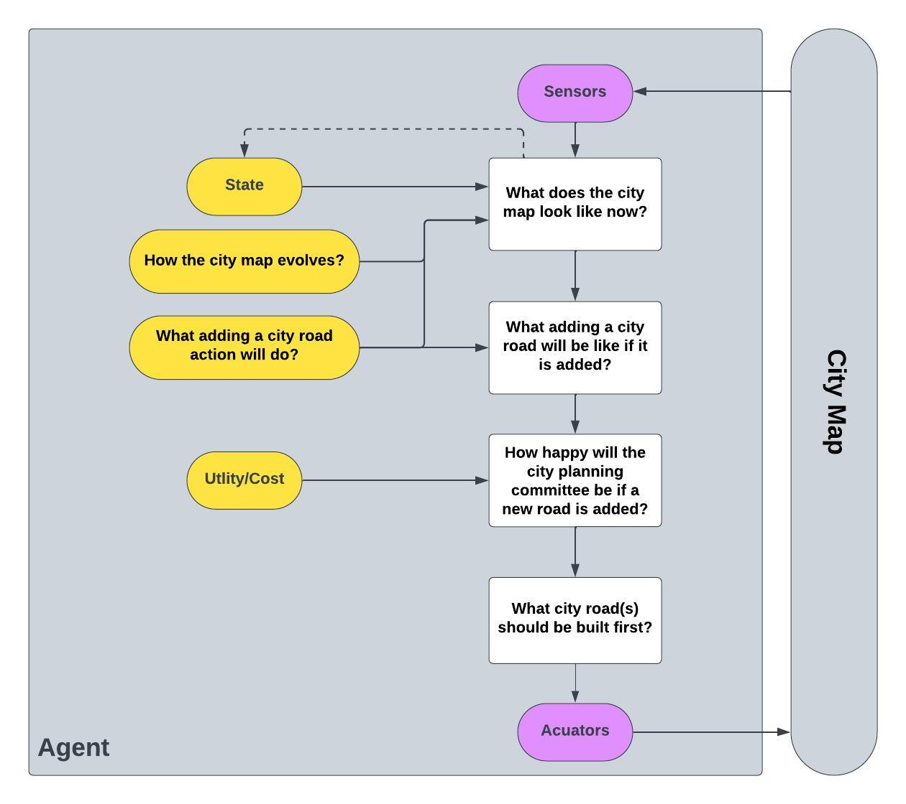
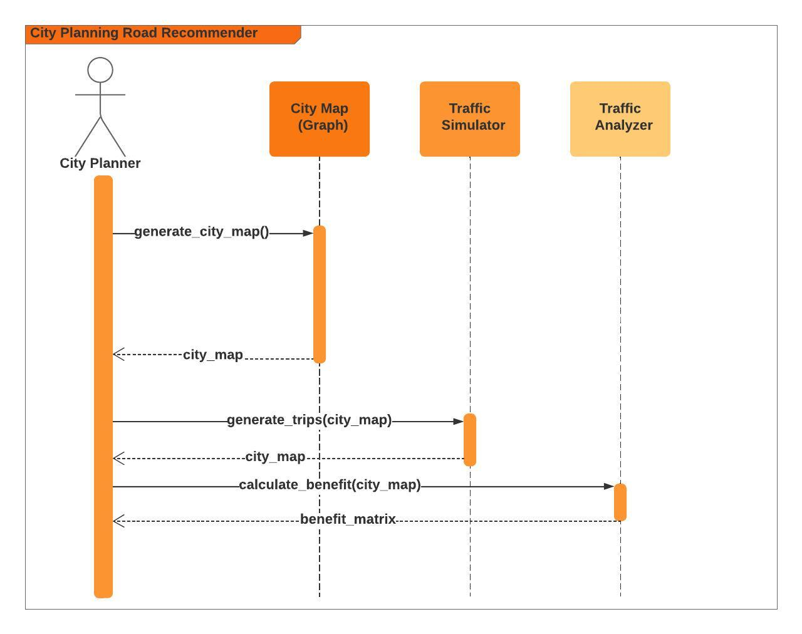

<!-- ABOUT THE PROJECT -->

## About The Project

The application is  centered around city planning with the objective of reducing traffic congestion and journey time. The city’s road network is modelled by a graph as shown below (Figure 1) with nodes representing locations and edges representing roads connecting a pair of locations. Edges are bidirectional in the sense that journeys can take place in either direction along the edge. 

The objective of the city planner is to determine which new roads need to be built in order to meet the twin objectives of reducing journey time and traffic congestion. 

<b>Figure 1 - City Map Graph</b>



<!-- Design -->
## Agent Architecture

This project will utilize a model-based, utility-based agent (Table 1).  As a partially observable, sequential, dynamic, continuous  multi-agent task dynamic programming (DP) is the preferred algorithmic method. 

<b>Table 1 - Aritificial Intelligence (A.I.) Project Archetype</b>

| Type        | Sub Type            | Algorithm                |
|-------------|---------------------|--------------------------|
| Model-based | Utility-based Agent | Dynamic Programming (DP) |

As a result, applying a model-based, utility-based agent is the preferred architecture (Fig 2).

<b>Figure 2 - Agent Architecture </b>
<br>



The architectural components are broken down in Table 2.

<b>Table 2 - Architectural Components </b>

| Component                                                             | Description                                                                                                    | 
|-----------------------------------------------------------------------|----------------------------------------------------------------------------------------------------------------|
| State                                                                 | Traffic volume, Current Roads                                                                                  | 
| What does the city map look like now?                                 | Number of locations, number of roads, length or distance of each road, connections or edges between locations. |
| How the city map evolves?                                             | Adding new roads (ie. 3 budgeted new roads in city map planning).                                              |
| What adding a city road action will do?                               | Utility or cost of adding new road.                                                                            |
| What adding a city road will be like if it is added?                  | How will drivers and subsequently traffic be impacted by adding the new road?                                  |
| How happy will the city planning committee be if a new road is added? | Road benefity to the city (ie. reduced commute time for drivers).                                              |
| What city road(s) should be built first?                              | Ordered list of roads with the highest benefit to the city.                                                    |


<p align="right">(<a href="#readme-top">back to top</a>)</p>


<!-- Design -->
## High-level Agent Design
The system is designed with three major components which is the city map or graph, the Traffic Simulator, and Traffic Analyzer.  These components are laid out in Figure 3 and Table 3.

<b>Table 3 - System (Agent/Environmental) Component Descriptions</b>

| Component         | Description                                                                                                                 | 
|-------------------|-----------------------------------------------------------------------------------------------------------------------------|
| City Map (Graph)  | Dynamic or Statically generated map using the networkx python package.                                                      | 
| Traffic Simulator | Python algorithms to dynamically generate trips along each road segment.                                                    |
| Traffic Analyzer  | Python DP algorithms to calculate the benefit of adding new budgeted roads.   |
<br>

<b>Figure 3 - System (Agent/Environmental) Sequence Diagram</b>
<br>


<p align="right">(<a href="#readme-top">back to top</a>)</p>

## Low-level Agent Design

The various variables or parameters that will be utilized within the city map, traffic simulator, and traffic analyzer are outlined in Table 4.
<b>Table 4 - Parameters</b>

|             | Variable | Description                                                       | Data Type | Fixed Value | Default Value | Rule                                                                                                                  | 
|-------------|----------|-------------------------------------------------------------------|-----------|-------------|---------------|-----------------------------------------------------------------------------------------------------------------------|
| Requirement |          |                                                                   |           |             |               |                                                                                                                       | 
| R3-R5       | N        | Number of locations (nodes) in the network                        | integer   | 60          |               |                                                                                                                       |   
| R3-R5       | p        | Average connectivity of nodes across the network                  | float     |             |               |                                                                                                                       |
| R2          | ""       | ""                                                                | ""        | 5.00        |               |                                                                                                                       |
| R3-R5       | ""       | ""                                                                | ""        | 0.05        |               | If .05 does not result in a connected network increase the value progressively by .01 until connectivity is obtained. |  
| R2-R5       | L        | Road length parameter                                             | integer   |             |               | Existing Roads: range(5, 25), New Roads:  d(X,Y) = f(sp(X,Y)) -See Simulation Function sp()                           |  
| R2-R5       | T        | Number of trips to be generated at each clock tick                | integer   |             | 100           |                                                                                                                       |   
| R2-R5       | k        | Number of new roads that can be budgeted                          | integer   |             | 3             |                                                                                                                       |
| R2-R5       | f        | Shrinkage factor to use when determining the size of a new road.  | float     |             |               | rand(0.6, 0.8)                                                                                                        |   

There will be many python functions implemented.  But, one of the requirements that must be met is the function below in Table 5.  
<b>Table 5 - Functions </b>

|             | Function | Description                                                                                        | Input                                                         | Output | Default Value | Rule                                                           | 
|-------------|----------|----------------------------------------------------------------------------------------------------|---------------------------------------------------------------|--------|---------------|----------------------------------------------------------------|
| Requirement |          |                                                                                                    |                                                               |        |               |                                                                | 
| R2-R5       | sp(X,Y)  | Length of new roads which represent direct connections between two locations need to be generated. | (X, Y): X = first location (node), Y = second location (node) | L      | 0.6           | Shortest path between X and Y as determined by Dijkstra or A*. |   


### Traffic Simulator
The pseudo code for the Traffic Simulator module is outlined below:
```shell
    for seconds in (8 AM - 6 PM) # 10 hour time span
      for second in seconds:
        trips = generate_trips(trip_count=100)
   
      for road in city_map.get_random_roads():
        calculate_volume(road, trips)
```

### Traffic Analyzer
The pseudo code for the Traffic Analyzer module is outlined below:
```shell
    new_roads = 3
    benefit_matrix(x, y)
    build_benefit_matrix(benefit_matrix)
     
    for road in new_roads:
      # Should randomly select two nodes that are not directly connected
      build_new_road(city_map, road) 
      update_benefit_matrix(benefit_matrix)
  
    identify_roads_with_highest_benefit(road, benefit_matrix)
````

There are various mathematical proofs that must be theoretically applied.  Given the fact that there are n number of budgeted roads (eg. 3) a maximum benefit is never reached for this particular project.  However, for completeness and mathematical compliance the following proofs still apply.

The expected reward of the given actin (a) of the agent, which in this case is the city planner is as follows:

<b>Expected reward given the action (a) is selected:</b>


<br>

where <br>
E = Expectation of taking an action <br>
t = time the action is taken <br>
R = Reward given after the action is taken <br>
A = Action actually taken <br>
a = In general, the action taken to evaluate the recommended road benefit:

<br>

<br>

Estimation of the average rewards actually received:


where the indicator function 1 predicate denotes the random variable that is 1 if the predicate is true and 0 if it is not.

Note, At is the greedy action to select the roads that have the greatest beneft to the city:


<br>

where argmax(a) denotes the action (a) for which the expression that follows is maximized (with ties broken arbitrarily).  In this particular problem, we will simply choose the roads that have the greatest benefit in descending order.  Greed action selection always exploits current knowledge to maximiize immediate reward.  In other words, the city planner will spend no time sampling inferior road benefits to see if other roads might really benefit the city even more.

If the denominator of the reward estimation function is 0 then we instead define Qt(a) as some default value, such as 0.  As the denominator goes to infinity, Qt(a) coverges to q*(a).  This proof is defined by the limit below.

Assume the benefit B(x,y) is defined on rewards for all tuples (x,y) in some open interval containing the rewards actually received Qt(a), except possibly at Qt(a). The limit of B(x,y) as (x,y) approaches Qt(a) is L:


<br>
<br>
where for every ε > 0 there is a δ > 0 such that if for any number of road recommendations 0 < |(x,y) - Qt(a)| < δ, then |B(x,y) - L| < ε.

<br>


<p align="right">(<a href="#readme-top">back to top</a>)</p>

### Built With

This section lists all major frameworks/libraries used to bootstrap this project.

* [![Python][Python.org]][Python-url]
* [![Jupyter][Jupyter.org]][Jupyter-url]
* [![Miniconda][Miniconda.com]][Miniconda-url]

<!-- GETTING STARTED -->

## Getting Started

Following the instructions below should get you up and running and quickly as possible without googling around to run
the code.

### Prerequisites

Below is the list things you need to use the software and how to install them. Note, these instructions assume you are
using a Mac OS. If you are using Windows you will need to go through these instructions yourself and update this READ
for future users.

1. miniconda
   ```sh
   cd /tmp
   curl -L -O "https://github.com/conda-forge/miniforge/releases/latest/download/Mambaforge-$(uname)-$(uname -m).sh"
   bash Mambaforge-$(uname)-$(uname -m).sh
   ```

2. Restart new terminal session in order to initiate mini conda environmental setup
   
### Installation

Below is the list of steps for installing and setting up the app. These instructions do not rely on any external
dependencies or services outside of the prerequisites above.

1. Clone the repo
   ```sh
   git clone git@github.com:johnsonlarryl/csce_5210.git
   ```
2. Install notebook
   ```
   cd traffic_simulator
   conda env create -f environment.yml
   conda activate traffic_simulator
   ```

<p align="right">(<a href="#readme-top">back to top</a>)

<!-- USAGE EXAMPLES -->

## Usage

In order to view or execute the various notebooks run the following command on any of the sub folders in this directory.

Here is an example to launch the Traffic Simulator and Analysis Notebooks.

```sh
jupyter notebook
```

Once inside the
notebook [use the following link](https://jupyter-notebook.readthedocs.io/en/stable/examples/Notebook/Running%20Code.html)
on examples of how to use the notebook.

<p align="right">(<a href="#readme-top">back to top</a>)</p>

<!-- ACKNOWLEDGEMENT -->
## Acknowledgements
* Richard S. Sutton, Andrew G. Barto. Reinforcement Learning, second edition: An Introduction (Adaptive Computation and Machine Learning series), 2nd edition. Bradford Books, 2018.
* Peter Norvig, Stuart Russell. Artificial Intelligence: A Modern Approach, Global Edition, 4th edition. Pearson, 2021.

<!-- CONTACT -->

## Contact
[Larry Johnson](mailto:johnson.larry.l@gmail.com)
<br>


Project Link: [https://https://github.com/johnsonlarryl/csce_5210](https://github.com/johnsonlarryl/csce_5210)

<p align="right">(<a href="#readme-top">back to top</a>)</p>

<!-- MARKDOWN LINKS & IMAGES -->
<!-- https://www.markdownguide.org/basic-syntax/#reference-style-links -->

[Jupyter-url]:https://jupyter.org

[Jupyter.org]:https://img.shields.io/badge/Jupyter-F37626.svg?&style=for-the-badge&logo=Jupyter&logoColor=white

[Python-url]:https://python.org

[Python.org]:https://img.shields.io/badge/Python-3776AB?style=for-the-badge&logo=python&logoColor=white

[Miniconda-url]:https://docs.conda.io/

[Miniconda.com]:https://img.shields.io/badge/conda-342B029.svg?&style=for-the-badge&logo=anaconda&logoColor=white